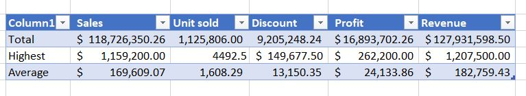

# My-Second-Excel-Data-analysis-project

## Introduction
The aim of this project is to analyse a large sales data set cutting across different countries and different products within a specific period of time
## AIM
Using the same Sales Data, determine the following
- The total Revenue and Profit generated
- The average Revenue and Units Sold for every order
- The total Discount given in $
- Total number of sales recorded
- The highest Profit generated
- Create a column named ‘Sales Range’, return ‘High Sales’ if the Sales value is above average, otherwise, return ‘Low Sales’.

## Procedure
- Clean data by getting rid of blanks and duplicates
- Format each column header properly
- Put data in a table
- Create a sub table where calculated data will be tabulated

## Task 1 and Solution
To get total revenue and total profit, we will need to make use of the '**SUM**' function, highlighting the column range where we have the revenue and profit
## Task 2 and Solution
To get average revenue and units sold for every order, we will make use of the '**AVERAGE**' function, and '**SUM**', highlighting the column range where we have the revenue and units sold. 
Thesame process is repeated for task **3** and **4**
## Task 5 and Solution
To get the highest profit generated, you use the '**MAX**' function on the profit column.

Table below shows the data

## Task 6 and Solution
- First we create another column in the table
- Then apply the '**IF**' function. Using the **average** sale calculated as reference and test that value on the sales column, using the '**IF**' syntax

The table below shows the outcome

